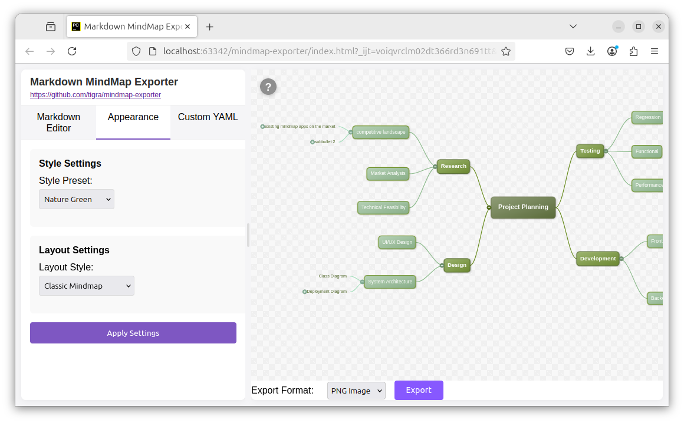

# Simple Markdown to Mindmap converter

[Try it online](https://tigra.github.io/mindmap/)

Convert your Markdown (e.g. edited in Obsidian, with Enhancing Mindmap plugin, or elsewhere) with headings and bullet points to a mindmap (.png, .svg).

## HOWTO
1. Open the [online demo](https://tigra.github.io/mindmap/) or serve locally (see [Development](#development) below)
2. Copy-paste your Markdown content with headings and/or bullet points into the text area
3. Play with the settings and click `Generate MindMap`
4. Click `Export` to save the result as SVG or PNG

## Development

This project uses Vite for modern ES module bundling.

### Setup
```bash
# Install dependencies
npm install
```

### Development server
```bash
# Start local development server
npm run dev
```

### Build for production
```bash
# Build optimized bundle
npm run build

# Preview the production build
npm run preview
```

## Navigation Controls
* Scroll: Mouse wheel to scroll vertically or Arrow keys
* Horizontal Scroll: Shift + Mouse wheel or Shift + Arrow keys
* Pan: Middle-click drag or Ctrl + left-click drag
* Zoom in/out: Ctrl + Mouse wheel up/down
* Faster Scroll: Page Up/Down keys
* Jump to Edges: Home/End keys

## How does it look


## Additional tool

Conversion of bullet points to nested headings:

```shell
python transform.py file1.md > file2.md  # transforms nested bullet points to nested headings
```

(not needed anymore because the page supports bullet points itself, but just in case :) 

## Layouts

The mindmap exporter supports several layout types that can be selected from the dropdown menu. Each layout organizes nodes in a different way, suitable for different types of information structures.

### Classic MindMap Layout

The Classic MindMap Layout places the parent node in the center with children distributed evenly on both sides. Children are vertically centered relative to the parent.

```
    Left Column                 Parent                 Right Column
    +---------+               +--------+               +----------+
    | Child 1 |------+        |        |        +------|  Child 4 |
    +---------+      |        |        |        |      +----------+
                     |========# Parent #========|
    +---------+      |        |  Node  |        |      +----------+
    | Child 2|+------+        |        |        +------|  Child 3 |
    +---------+               +--------+               +----------+
```

Best suited for:
- Traditional mind mapping
- Balanced content organization
- Presentations where the main topic has equal importance on subtopics

### TapRoot Layout

The TapRoot Layout distributes children in balanced left and right columns, similar to the Classic layout, but places them below the parent node. Child nodes are arranged vertically, maintaining a consistent horizontal alignment in each column.

```
                +--------------------+
                |      Parent        |
                +--------------------+
                      | |  | |                      
    Left Column       | |  | |    Right Column      
+---------+---------+ | |  | | +---------+---------+
| +---------------+ | | |  | | | +---------------+ |
| |    Child 1    |-|-+ |  | +-| |   Child 3     | |
| +---------------+ |   |  |   | +---------------+ |
|                   |   |  |   |                   |
| +---------------+ |   |  |   | +---------------+ |
| |    Child 2    |-|---+  +---|-|    Child 4    | |
| +---------------+ |          | +---------------+ |
+-------------------+          +-------------------+
```

Best suited for:
- Hierarchical structures
- Balanced categorization
- When visual balance is important

### Vertical Layout

The Vertical Layout arranges children horizontally below (or above) the parent node. Nodes are centered when possible, and siblings are placed side by side.

```
                +--------------------+
                |      Parent        |
                +--------------------+
                       | | |
          +------------- | +-------------+
          |              |               |
+---------+----+ +-------+------+ +------+-------+
|   Child 1    | |   Child 2    | |   Child 3    |
+--------------+ +--------------+ +--------------+
```

Two direction options are available:
- **Vertical Down**: Places children below the parent (shown above)
- **Vertical Up**: Places children above the parent

Best suited for:
- Hierarchical organization charts
- Simple top-down or bottom-up flows
- When horizontal relationships are important

### Horizontal Layout

The Horizontal Layout places children vertically to the right (or left) of the parent node. Children are arranged in a vertical stack.

```
                       +----------------+
                   ____|    Child 1     |
+----------------+/    +----------------+
|                |     +----------------+
|     Parent     |-----|    Child 2     |
|                |     +----------------+
+----------------+\_   +----------------+
                    \__|    Child 3     | 
                       +----------------+
```

Two direction options are available:
- **Horizontal Right**: Places children to the right of the parent (shown above) 
- **Horizontal Left**: Places children to the left of the parent

Best suited for:
- Process flows
- Timeline visualizations
- When vertical relationships are important

### Outline Layout

The Outline Layout places all children in a vertical column to the side of the parent node, creating a structure similar to traditional outlines or table of contents. This layout supports precise positioning control through edge alignment settings.

```
Near edge:                          Far edge:
                                        
+----------+                           +----------+   
|  Parent  |                           |  Parent  |   
+----------+                           +----------+   
 | +---------+                                          +----------+
 +-|Child 1  |                                          | Child 1  |
 | +---------+                                          +----------+
 | +---------+                                          +----------+
 +-|Child 2  |                                          | Child 2  |
 | +---------+                                          +----------+
 | +---------+                                          +----------+ 
 +-|Child 3  |                                          | Child 3  |
   +---------+                                          +----------+
```

**Edge Alignment Options:**
- **Near Edge**: Positions children relative to the parent's near edge (the edge closest to the children)
  - Left direction: Children's right edges align relative to parent's right edge
  - Right direction: Children's left edges align relative to parent's left edge
- **Far Edge**: Positions children relative to the parent's far edge (the edge furthest from the children)
  - Left direction: Children's right edges align relative to parent's left edge  
  - Right direction: Children's left edges align relative to parent's right edge

**Connection Points:**
- **Near Edge**: Parent connects from its bottom edge at a point halfway between the near edge and the alignment line
- **Far Edge**: Parent connects from its side edge (left for left direction, right for right direction)

Two direction options are available:
- **Outline Left**: Places children to the left of the parent
- **Outline Right**: Places children to the right of the parent

Best suited for:
- Document outlines and table of contents
- Sequential processes and workflows
- When precise alignment control is needed
- Lists and hierarchical structures with many items

### Vertical-over-TapRoot Layout

This special layout combines a Vertical layout at the root level with TapRoot layouts for all second-level nodes. It creates a hybrid structure where main topics are arranged horizontally, and each main topic has its own balanced TapRoot-style subtree.

```
                                                 Root Node
                                                     |
            +--------------------------------------------------------------------------------------+
            |                             |                               |                        |
      +----+-----+                  +----+-----+                     +----+-----+             +----+-----+
      | Topic 1  |                  | Topic 2  |                     | Topic 3  |             | Topic 4  |
      +----------+                  +----------+                     +----------+             +----------+
          |  |                          |  |                             |  |                     |  |
          |  |                          |  |                             |  |                     |  |
+---------+  +----+----+      +---------+   +---------+        +---------+  +---------+ +---------+  +---------+
|Subtopic1|  |Subtopic2|      |Subtopic3|   |Subtopic4|        |Subtopic5|  |Subtopic6| |Subtopic7|  |Subtopic8|
+---------+  +---------+      +---------+   +---------+        +---------+  +---------+ +---------+  +---------+
```

Best suited for:
- Complex, multi-level hierarchies
- Large mindmaps with many branches
- When you want to emphasize main categories while keeping subtopics balanced

### Connection Points

Each layout supports multiple connection point modes that control how lines connect parent nodes to their children:

- **Single**: All connections from a parent node originate from a single central point
- **Distributed Relative to Size**: Connection points are positioned based on the child's actual position
- **Distribute Evenly**: Connection points are evenly spaced along the parent node edge

Different layouts use different amounts of the parent width for connections: vertical layouts use 75% and TapRoot layouts use 40% to maintain consistent visual appearance.

## Layout-Specific Configuration

The mindmap exporter features a dynamic configuration system that shows relevant settings only for the currently selected layout. This keeps the interface clean and uncluttered while providing precise control where needed.

### How It Works

1. **Automatic Display**: When you select a layout from the "Layout Style" dropdown, the interface automatically shows only the configuration options relevant to that layout.

2. **Layout Settings Section**: A "Layout Settings" section appears below the general layout controls when layout-specific options are available for the selected layout.

3. **Contextual Options**: Each setting group is tagged with the layouts it applies to, ensuring users only see options that will affect their current mindmap.

### Current Layout-Specific Settings

**Outline Layout (Left & Right)**
- **Edge Alignment**: Controls how children are positioned relative to the parent node
  - *Near edge*: Positions children relative to the parent's near edge (closest to children)
  - *Far edge*: Positions children relative to the parent's far edge (furthest from children)

### For Developers

The system uses a data attribute approach for maximum flexibility:

```html
<!-- Setting group that applies to outline layouts -->
<div class="layout-settings-group" data-layouts="outline-left,outline-right">
    <div class="form-group">
        <label for="outline-edge-alignment">Edge Alignment:</label>
        <select id="outline-edge-alignment">
            <option value="near" selected>Near edge</option>
            <option value="far">Far edge</option>
        </select>
    </div>
</div>
```

**Adding New Layout-Specific Settings:**
1. Create a `.layout-settings-group` div with appropriate `data-layouts` attribute
2. Add your form controls inside the group
3. The JavaScript automatically handles show/hide logic
4. Add any necessary event handlers for your new controls

**Supported Layout Identifiers:**
- `horizontal-left`, `horizontal-right`
- `vertical`, `vertical-up`
- `taproot`
- `classic`
- `outline-left`, `outline-right`
- `vertical-over-taproot`

This system is designed to scale as more layouts and configuration options are added to the mindmap exporter.

