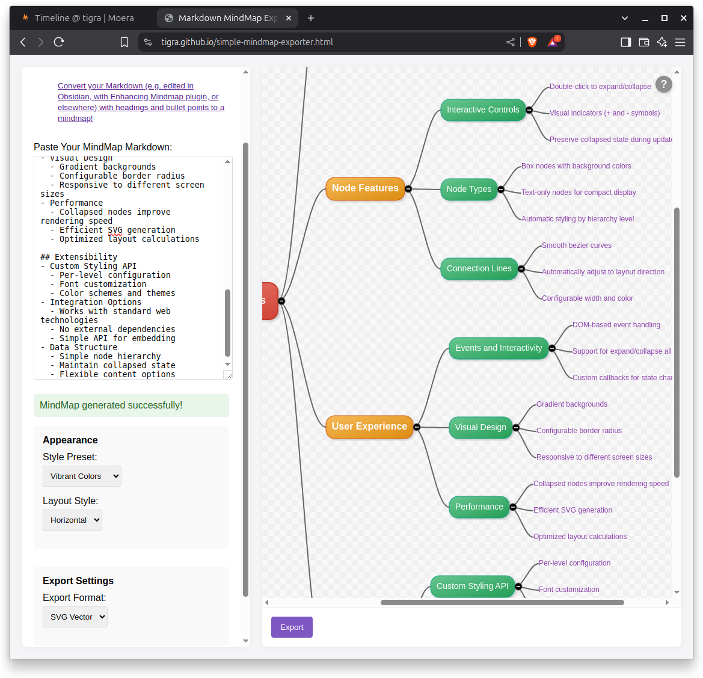

# Simple Exporter for Obsidian Enchancing Mindmap Plugin (or other) markdown to Mind Map image

## HOWTO

1. In case your markdown contains bullet points, convert them to headings:

```shell
python transform.py file1.md > file2.md  # transforms nested bullet points to nested headings
```

2. Open `simple-mindmap-exporter.html` in a browser
3. Copy-paste the contents of `file2.md` (or, just the output from the console)
to the text area. Play with the settings. Click `Generate MindMap`.
4. Then click `Export` to save the result as .png or .svg.

## How does it look

