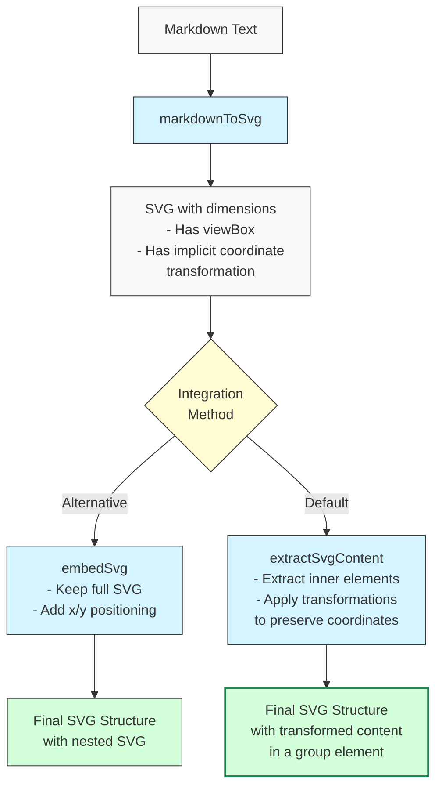

```mermaid
graph TD
    A[Markdown Text] --> B[markdownToSvg]
    B --> C["SVG with dimensions<br>- Has viewBox<br>- Has implicit coordinate<br>transformation"]
    
    C --> D{Integration<br>Method}
    
    D -->|Alternative| E["embedSvg<br>- Keep full SVG<br>- Add x/y positioning"]
    D -->|Default| F["extractSvgContent<br>- Extract inner elements<br>- Apply transformations<br>to preserve coordinates"]
    
    E --> G[Final SVG Structure<br>with nested SVG]
    F --> H[Final SVG Structure<br>with transformed content<br>in a group element]

    classDef default fill:#f9f9f9,stroke:#333,stroke-width:1px;
    classDef highlight fill:#d4f4ff,stroke:#333,stroke-width:1px;
    classDef decision fill:#fffcd4,stroke:#333,stroke-width:1px;
    classDef output fill:#d4ffdb,stroke:#333,stroke-width:1px;
    classDef preferred fill:#d4ffdb,stroke:#1a8754,stroke-width:2px;
    
    class B highlight;
    class D decision;
    class E highlight;
    class F highlight;
    class G output;
    class H preferred;
```