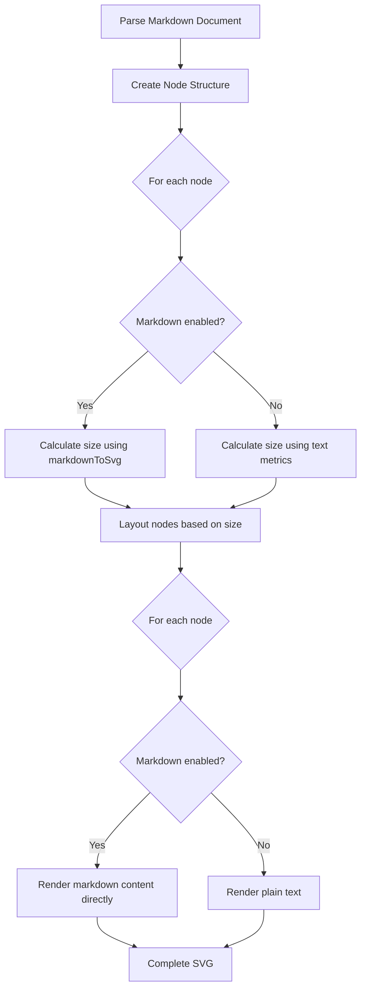
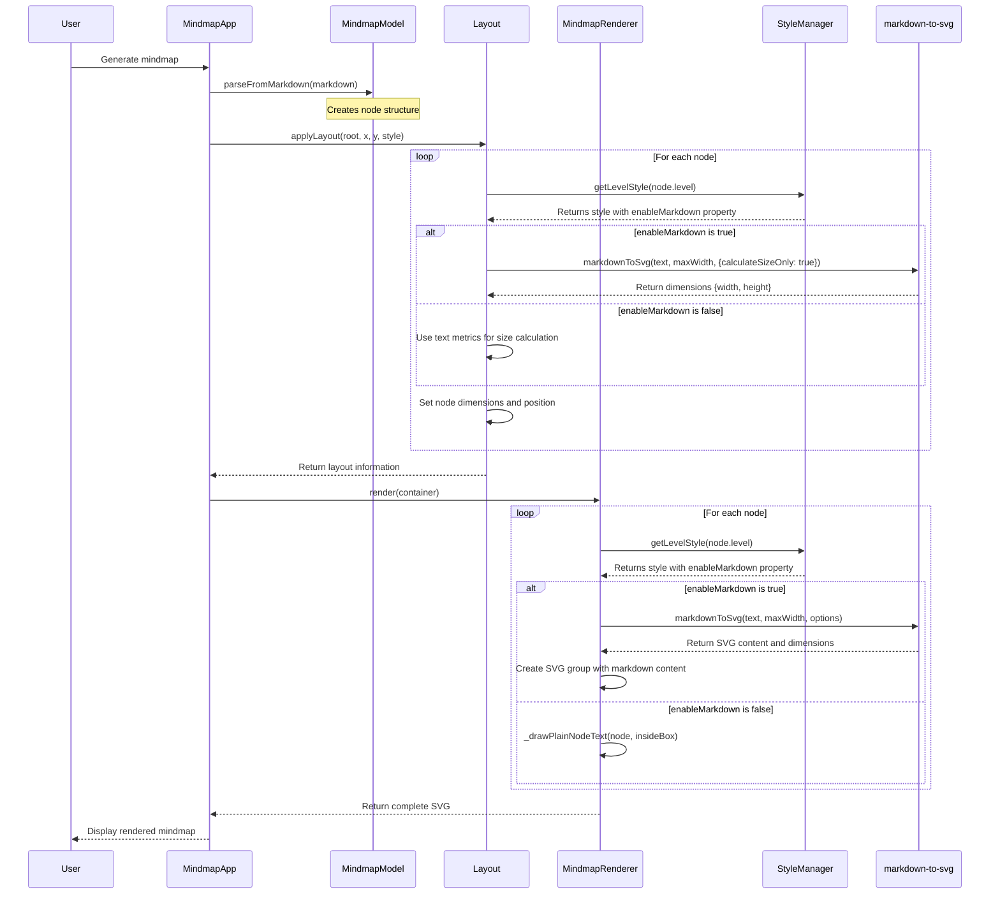

```mermaid
flowchart TD
    A[Parse Markdown Document] --> B[Create Node Structure]
    B --> C{For each node}
    C --> D{Markdown enabled?}
    D -->|Yes| E[Calculate size using markdownToSvg]
    D -->|No| F[Calculate size using text metrics]
    E --> G[Layout nodes based on size]
    F --> G
    G --> H{For each node}
    H --> I{Markdown enabled?}
    I -->|Yes| J[Render markdown content directly]
    I -->|No| K[Render plain text]
    J --> L[Complete SVG]
    K --> L
```

```mermaid
sequenceDiagram
    participant User
    participant App as MindmapApp
    participant Model as MindmapModel
    participant Layout as Layout
    participant Renderer as MindmapRenderer
    participant Style as StyleManager
    participant Converter as markdown-to-svg
    
    User->>App: Generate mindmap
    App->>Model: parseFromMarkdown(markdown)
    Note over Model: Creates node structure
    
    %% Layout Phase - Calculate Node Sizes
    App->>Layout: applyLayout(root, x, y, style)
    
    loop For each node
        Layout->>Style: getLevelStyle(node.level)
        Style-->>Layout: Returns style with enableMarkdown property
        
        alt enableMarkdown is true
            Layout->>Converter: markdownToSvg(text, maxWidth, {calculateSizeOnly: true})
            Converter-->>Layout: Return dimensions {width, height}
        else enableMarkdown is false
            Layout->>Layout: Use text metrics for size calculation
        end
        
        Layout->>Layout: Set node dimensions and position
    end
    
    Layout-->>App: Return layout information
    
    %% Rendering Phase - Generate SVG
    App->>Renderer: render(container)
    
    loop For each node
        Renderer->>Style: getLevelStyle(node.level)
        Style-->>Renderer: Returns style with enableMarkdown property
        
        alt enableMarkdown is true
            Renderer->>Converter: markdownToSvg(text, maxWidth, options)
            Converter-->>Renderer: Return SVG content and dimensions
            Renderer->>Renderer: Create SVG group with markdown content
        else enableMarkdown is false
            Renderer->>Renderer: _drawPlainNodeText(node, insideBox)
        end
    end
    
    Renderer-->>App: Return complete SVG
    App-->>User: Display rendered mindmap
```